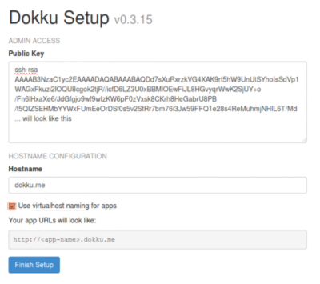
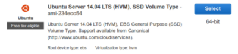
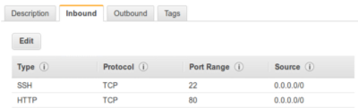

# Dokku - AWS Tutorial
A tutorial on setting up Dokku on your local machine via Vagrant and on AWS EC2. Thanks to [this article](https://medium.com/@alfeto/dokku-on-vagrant-and-aws-with-postgres-8a591bb48f51) for teaching me how to do this. 

## Installation
1. Clone the [Dokku repo](https://github.com/dokku/dokku) to your local machine  
`git clone git@github.com:dokku/dokku.git`

2. Install [Vagrant](https://docs.vagrantup.com) (I suggest installing via [brew cask](http://caskroom.io/))  
`brew cask install vagrant`

3. Install [VirtualBox](https://www.virtualbox.org) in order to set up Vagrant  
`brew cask install virtualbox`

4. (Optional) I would also install [Vagrant Manager](http://vagrantmanager.com) to manage your Vagrant machines  
`brew cask install vagrant-manager` 

## Set up project for Dokku
For this tutorial, I'm going to use an Express app as an example. You can clone the example app repo [here.](https://github.com/kevinnguy/express-example)

The folder name should be `express-example` and we will use this name as our project name for the tutorial.

## Set up Dokku on your local Vagrant machine
1. Create the Vagrant virtual machine by changing directory to your local Dokku repo  
`cd /path/to/local/dokku`

2. Create a Vagrant virtual machine with Dokku!  
`vagrant up`

3. You want to set the local IP (default is 10.0.0.2) of your Vagrant machine in your `/etc/hosts` file and pick a hostname. For this tutorial, we will use the hostname `dokku.me`  
`10.0.0.2 dokku.me`

## Finish setting up Dokku on your local Vagrant machine
1. Access [dokku.me](http://dokku.me) on your browser.  

2. Paste your ssh public key, found at `~/.ssh/id_rsa.pub`. This ssh public key should be the same key you used to clone the example app.

3. For `Hostname` we will use `dokku.me`

4. Check `Use virtualhost naming for apps` This will allow you to access `<project-name>.dokku.me`

5. Edit your `/etc/hosts/` file and add another host  
`10.0.0.2 express-example.dokku.me`

## Set up project for Dokku (Part 2)
1. Add the new Dokku instance as a git remote to our example app so we can start pushing changes locally to Dokku on our local Vagrant virtual machine. 
`git remote add local dokku@dokku.me:express-example`

2. Make a change to your view in the Express example app and push your changes  
`git push local master`

# We're half way there!
Now we're going to set up Dokku on our AWS EC2 server so we can push our changes remotely to our server.

## Set up AWS
1. Launch a new instance for EC2.

2. From the Quick Start page, select the Ubuntu Server machine image.  

3. Select any instance type. For this tutorial, you probably want to select the `t2.micro` type, since it is eligible for free tier users.

4. Configure your security group by adding types:
    - `SSH` on port `22`
    - `HTTP` on port `80`  

5. Launch your new instance and download the `.pem` file for ssh access.

6. Once you have launched your instance, get it's public IP and add it to your `/etc/hosts` file. We will use the hostname `dokku.aws.me`  
`<instance's public IP> dokku.aws.me`

## Set up Dokku on your EC2 instance

